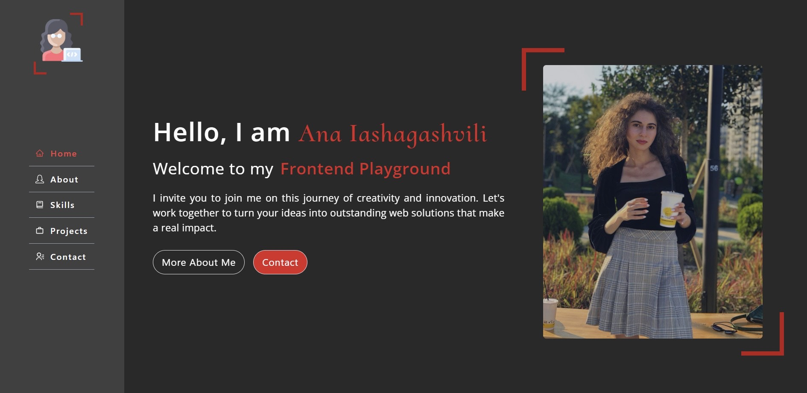

# My Portfolio Website

Welcome to my personal portfolio website built with React.js. This website showcases my journey in the world of frontend development, my certificates, skills, projects, and provides a way to get in touch with me.




## Table of Contents
- [Introduction](#introduction)
- [Technologies Used](#technologies-used)
- [Features](#features)
- [Project Structure](#project-structure)
- [Installation](#installation)
- [Usage](#usage)
- [Screenshots](#screenshots)
- [Contact](#contact)
- [License](#license)


## Introduction
This portfolio website serves as a platform to present my journey in code, my certificates, skills, and projects. Whether you're a fellow developer or a potential employer, you can learn more about my skills, experiences, and get in touch with me easily.


## Technologies Used
- **React.js**: The core framework for building the front-end.
- **EmailJS**: for contact form.
- **React Icons**: Provides a wide range of icons for the user interface.
- **React Slick and Swiper**: for project carousels.
- **React Scroll**: For scrolling on the same page. 
- **Tailwind CSS**: The CSS framework for styling.
- **Vite**: The development and bundling tool.
- **ESLint**: Ensures code quality through linting.
- **GitHub**: Used for version control.


## Features
- **About Me**: Learn about my motivation and journey in code.
- **Skills**: Explore my skills and certifications.
- **Projects**: Check out my projects with images and descriptions.
- **Contact**: Get in touch with me via WhatsApp, email, or Instagram.
- **Footer**: A simple footer with links to my social profiles.

## Project Structure
  - `src/`: Source code for the website.
  - `components/`: React components for each page and shared components.
  - `images/`: Images used throughout the website, including the homepage and projects.
  - `App.js`: Main application component.
  - `Contact.js`: React component for the contact page.


## Installation
To run this project locally, follow these steps:

1. Clone this repository:
   ```bash
   git clone https://github.com/ana-1995/my-portfolio.git

# my-portfolio
